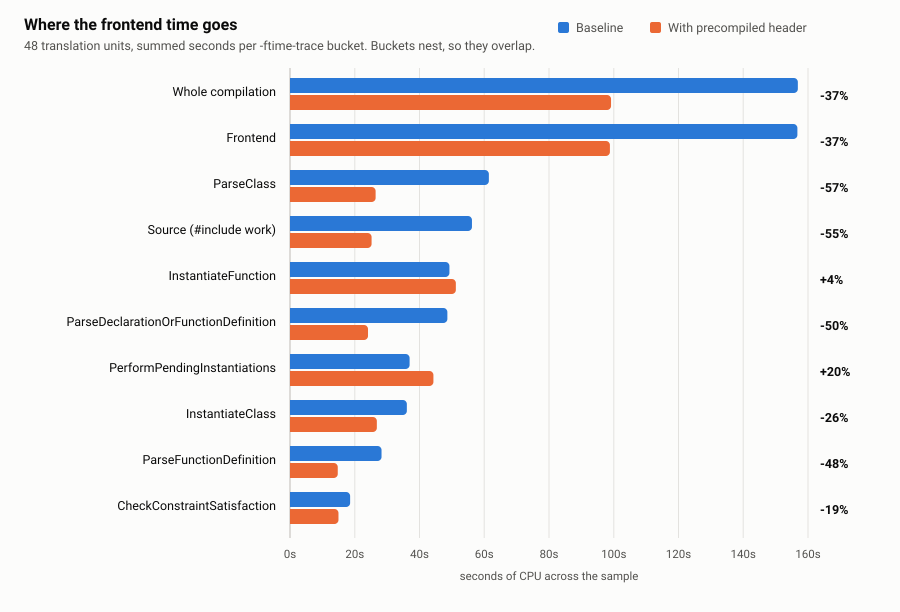
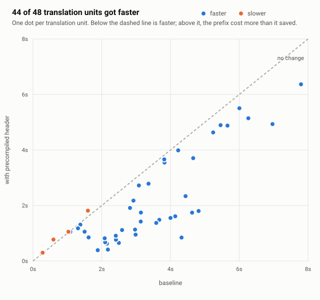

# Precompiled headers during indexing

Indexing is dominated by parsing the same external headers over and over. Sourcetrail cuts that by
compiling the headers a source group's files share into one `.pch` and prepending it to every parse
in that group. A user-configured precompiled header has always been supported; what is described
here is the automatic one, derived when the project names none.

Measured on this repository: **26% less CPU across the whole compilation database, 38% less on the
translation units a precompiled header actually covers.**

## Where the code lives

| Piece | Location |
| --- | --- |
| Include scan, prefix-header generation, PCH build | `src/features/project/logic/utilitySourceGroupCxx.cpp` |
| Per-macro-signature grouping, one PCH per group | `src/features/project/logic/SourceGroupCxxCdb.cpp` |
| Single PCH for a non-database source group | `src/features/project/logic/SourceGroupCxxEmpty.cpp` |
| The action that writes the `.pch` | `indexers/cxx/lib/data/parser/cxx/GeneratePCHAction.cpp` |
| Tests | `src/features/project/tests/AutoPchTestSuite.cpp`, `SourceGroupTestSuite.cpp` |

The build runs through `ICxxToolchain::buildPrecompiledHeader`, so the engine reaches it the same way
it reaches every other Clang operation -- through the indexer helper process.

## How the headers are chosen

`collectAutoPchIncludes()` reads the first 400 lines of every source file in the group and counts
`#include <...>` lines. An include is kept when it clears all four of these:

| Rule | Why |
| --- | --- |
| Angle brackets only | Quoted includes are how a project reaches headers it owns, and those must stay visible to the indexer. |
| Shared by ≥ 25% of the files, and ≥ 3 of them | Below that the prefix costs the parses that do not need it more than it saves the ones that do. |
| Does not resolve inside the indexed paths | A header inside a PCH never reaches `PreprocessorCallbacks`, so its include edges and macros would vanish from the index. |
| Never preceded by a `#define` in any file | `WIN32_LEAN_AND_MEAN` before `<windows.h>` changes what the header expands to; a prefix header is included before anything the source says. |

At most 64 headers go in, ordered by how many files share them.

A precompiled header is only accepted by a parse whose **macro state** matches the one it was built
with -- Clang rejects it outright otherwise. So a compilation database is first grouped by
`macroSignatureOf()` (the `-D`, `-U`, `-std` and `-x` flags, sorted), and each group of ≥ 8 files
gets its own PCH, up to 8 of them.

The build itself goes through `pchBuildFlags()`, shared with the user-configured path. Two details
there are load-bearing:

- **`-x c++-header`.** The generated prefix is a `.h`, which the driver compiles as C. A database
  entry that says only `clang++ -std=c++20` gives the file no language, and the PCH build fails on
  the first C++ header. Removing this line makes the compilation-database test go red.
- **No `-emit-pch`.** The driver has no such flag. The action that writes the output is handed to
  the tool directly; all the command line has to say is `-o`.

Parses then read it via `includePchFlagsFor()`:

```
-Xclang -fallow-pch-with-compiler-errors -include-pch <path>
```

`-fallow-pch-with-compiler-errors` is a **cc1** flag. Spelled without `-Xclang` the driver rejects
the entire command line rather than the flag, and every parse in the group fails.

A PCH whose build reported errors is deleted rather than used: `GeneratePCHAction` writes its output
even when the parse failed, and Clang then refuses that file for every source that includes it.

## Measured results

Method: this repository's own `compile_commands.json`, 585 translation units, parsed with
`clang++ 23.1.0` from `external/` using the same flags `CxxParser::getCommandlineArgumentsEssential`
passes (`-fno-delayed-template-parsing -fexceptions -w -ferror-limit=0 -fsyntax-only`), 64 parallel
parses. The selection above was reproduced exactly. CPU time is the metric that matters -- wall time
on an oversubscribed machine mostly measures the scheduler.

### Whole database

| | CPU | Wall |
| --- | --- | --- |
| Baseline | 2595.7 s | 44.1 s |
| With precompiled headers | 1912.8 s | 33.0 s |
| **Saved** | **682.8 s (26%)** | **11.0 s (25%)** |

Building all five precompiled headers cost 5.7 s CPU, so the saving nets out at 26%. No parse
failed in either run.

That 26% is diluted: only **257 of 585** translation units were covered. All 682 s came from those.

### What the groups looked like

| Group | Files | Headers chosen | PCH size |
| --- | --- | --- | --- |
| 0 | 266 | 0 | — |
| 1 | 153 | 1 (`QLabel`) | 32 MB |
| 2 | 60 | 3 (`gtest/gtest.h`, `gmock/gmock.h`, `memory`) | 20 MB |
| 3 | 28 | 0 | — |
| 4 | 21 | 1 (`algorithm`) | 3 MB |
| 5 | 15 | 4 (`gtest/gtest.h`, `gmock/gmock.h`, `string`, `thread`) | 20 MB |
| 6 | 8 | 2 (`algorithm`, `mutex`) | 4 MB |

One header can carry the whole win. `QLabel` appears in 46 of 153 GUI files and drags in most of
QtWidgets and QtCore behind it, which is the entire 32 MB.

### Where the time went

`-ftime-trace` over 48 translation units sampled from the five precompiled groups, run twice --
once plain, once with the group's precompiled header. The flag reaches the frontend through
`-Xclang` (see *Reproducing* below), at `-ftime-trace-granularity=0` so no `Source` event is
filtered out.



Buckets nest, so the rows overlap; read the direction, not the sum.

| Bucket | Baseline | With PCH | Change |
| --- | --- | --- | --- |
| ExecuteCompiler | 156.9 s | 99.2 s | **−37%** |
| Frontend | 156.7 s | 98.8 s | −37% |
| ParseClass | 61.4 s | 26.4 s | −57% |
| Source (`#include` work) | 56.2 s | 25.2 s | −55% |
| InstantiateFunction | 49.2 s | 51.2 s | +4% |
| ParseDeclarationOrFunctionDefinition | 48.6 s | 24.1 s | −50% |
| PerformPendingInstantiations | 36.9 s | 44.3 s | +20% |
| InstantiateClass | 36.1 s | 26.8 s | −26% |
| ParseFunctionDefinition | 28.3 s | 14.8 s | −48% |
| CheckConstraintSatisfaction | 18.6 s | 15.0 s | −19% |

Reading it: everything that *parses* roughly halves, which is the point -- the declarations arrive
deserialized instead of re-lexed and re-checked. Template instantiation does not, and
`PerformPendingInstantiations` **rises 20%**: those instantiations still have to happen per
translation unit, they simply move out of the header parse and into the end of the source. The win
is header parsing, not template work -- which is also why a group whose cost is mostly its own
templates gains little.

### It is not free for every file



Per translation unit, **44 of 48 got faster and 4 got slower**. The best case dropped 81%
(`IndexerWireEnumsTestSuite.cpp`); the worst rose 30% (`TextCodec.cpp`). The losers are the small
files near the origin: a translation unit that included little of the prefix still pays to
deserialize the whole thing. The group total stays far ahead, which is the trade the 25% threshold
is making -- and the reason the threshold exists at all.

For context, the same trace on an unmodified index run put `#include` work at 78% of frontend time,
with 60% of total time spent re-parsing headers another translation unit in the same run had already
parsed. That is the redundancy this removes, and 38% of it on covered units is what the current
heuristic reaches.

## Known limits

- **The 25%-of-files threshold missed the largest group.** Group 0 above is 266 files and got
  nothing: its most shared angle include appears in 22 of them (8%). Sourcetrail reaches most
  standard headers *transitively*, through its own quoted headers, so a direct-include scan sees
  little. Projects with a wide `#include <...>` habit -- or a Qt/gtest-shaped one -- do much better.
- **Only the first 400 lines are scanned.** Include blocks live at the top; reading further costs a
  lot on generated sources and finds nothing usable.
- **The scan is textual, not a dependency scan.** It cannot see what a header pulls in, which is why
  a single `QLabel` produces a 32 MB precompiled header. That is a feature for speed and a hazard
  for disk: precompiled headers land in the source group's `pch` dependency directory.
- **Groups smaller than 8 files get nothing**, and at most 8 groups are precompiled per database.
- **A group whose PCH build reports errors indexes without one.** Correct, but it means a single
  broken shared header costs the whole group its speedup.
- **A minority of files get slower** -- 4 of 48 in the sample above, up to 30%. Deserializing a
  prefix a file barely uses is not free. The group total absorbs it; a group where most files are
  small might not.

## Reproducing the measurement

`-ftime-trace` is a cc1 flag. The Clang driver silently drops it under `-fsyntax-only` -- the build
succeeds and no trace file appears -- so it has to go through `-Xclang`:

```bash
external/bin/clang++ -fno-delayed-template-parsing -fexceptions -w -ferror-limit=0 -fsyntax-only \
  -Xclang -ftime-trace=out.json -Xclang -ftime-trace-granularity=0 \
  <the compile_commands.json flags> file.cpp
```

To trace the same file *with* its precompiled header, add what a real parse gets:

```bash
  -Xclang -fallow-pch-with-compiler-errors -include-pch <group>.pch
```

`-ftime-trace-granularity=0` keeps the per-`#include` `Source` events; without it the short ones are
filtered out of the file, though the `Total ...` entries still account for them. Note that those
`Source` events are async `b`/`e` pairs, not the `X` events every other bucket uses -- pair them by
`id` to get per-header timings. The `Total ...` entries are the per-bucket sums the tables above
use; `ExecuteCompiler` is the whole run.

For a live index run rather than a synthetic one, see `docs/profiling.md`: `ENABLE_TRACY` puts
`cxx/tool.run` and `cxx/indexDecl` zones around the same work, and the difference between them is
the frontend cost this page is about.
