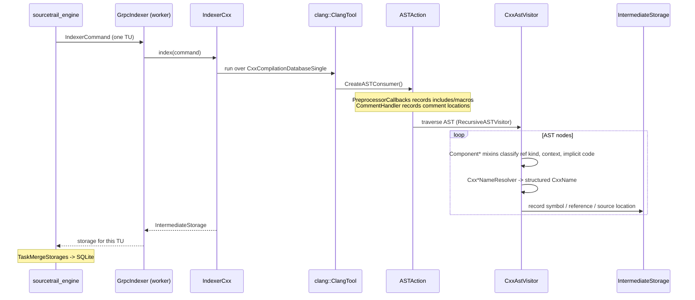

# Built-in C/C++ Indexer

Sourcetrail's C/C++ indexer plugin. It parses translation units with Clang's
`libTooling`, walks the AST to extract symbols, references, inheritance and call
edges, and streams the result back to the engine, which owns the SQLite index.

Enabled by the CMake option `BUILD_CXX_LANGUAGE_PACKAGE` (default `OFF`). With
it off, none of this directory is configured and **no indexer worker binary is
built at all**.

## Table of Contents
- [Layout](#layout)
- [How it is discovered](#how-it-is-discovered)
- [The worker process](#the-worker-process)
- [Indexing pipeline](#indexing-pipeline)
- [Helper mode](#helper-mode)
- [Building](#building)

---

## Layout

```
indexers/cxx/
  CMakeLists.txt      add_subdirectory(lib) then add_subdirectory(indexer)
  indexer/            Sourcetrail_indexer -- the worker executable
    main.cpp            argv parsing, logging, package registration, gRPC loop
    CxxHelperMode.cpp   --helper mode (see below)
    manifest.xml.in     plugin manifest template
  lib/                Sourcetrail_lib_cxx -- the language package
    LanguagePackageCxx.cpp      entry point; hands out IndexerCxx
    data/indexer/IndexerCxx.cpp the IndexerCommand -> parse -> storage step
    data/parser/cxx/            Clang frontend: ASTAction, ASTConsumer,
                                CxxAstVisitor (+ its Component* mixins),
                                CxxParser, PreprocessorCallbacks,
                                CanonicalFilePathCache, CxxDiagnosticConsumer
    data/parser/cxx/name/           Cxx*Name -- structured symbol names
    data/parser/cxx/name_resolver/  Cxx*NameResolver -- Clang decl/type -> name
    project/CxxToolchainLocal.cpp   local compiler/toolchain probing
    tests/                      CompilationDatabaseTestSuite
```

The heavier Clang-dependent parser suites live outside this tree, in
`tests/integration/lib_cxx/`.

## How it is discovered

There is **no special case for the built-in indexer** anywhere in the engine.
Like the Java plugin, it is resolved purely through a manifest:

`indexer/manifest.xml.in` is `configure_file`d at CMake configure time into
`<build>/app/plugins/cxx/manifest.xml`. `IndexerPluginRegistry::discover()`
(`src/lib/lib/app/`) scans `<app>/plugins/*/manifest.xml` at engine startup and
reads the source-group types each plugin claims. The engine reports those over
`GetCapabilities`, which is how the GUI decides which project types to offer —
a build without this package simply shows fewer options in the wizard.

`<indexerExecutable>` is the relative path `../../sourcetrail_indexer`, which
resolves from `<plugins>/cxx/` to the binary in both the build tree
(`<build>/app/`) and the install tree (`usr/bin/`).

## The worker process

`Sourcetrail_indexer` (output name `sourcetrail_indexer`) is spawned per
indexing job by the engine, never by the GUI:

```
sourcetrail_indexer <processId> --engine-endpoint <endpoint> <appPath> <userDataPath> [logFilePath]
```

`main.cpp` registers `LanguagePackageCxx` with the `LanguagePackageManager`,
installs `CxxToolchainLocal` as the `ICxxToolchain`, runs
`IndexerPluginRegistry::discover()`, then hands control to `GrpcIndexer`, which
pulls `IndexerCommand`s from the engine over gRPC and pushes back an
`IntermediateStorage` per translation unit. The engine merges those
(`TaskMergeStorages`) into the SQLite index.

Note the asymmetry in the process model: the GUI↔engine boundary is HTTP+JSON,
but the engine↔worker boundary here is still gRPC (`indexer_worker.proto`).

## Indexing pipeline



`CanonicalFilePathCache` keeps the many `SourceLocation` → canonical path
lookups from dominating the traversal.

## Helper mode

```
sourcetrail_indexer --helper <requestFile> <responseFile>
```

Answers a single toolchain question (header search paths, target triple, and
similar) for a process that has no Clang linked into it — the GUI and the engine
deliberately do not link a language package, so they shell out to this mode
instead. Implemented in `indexer/CxxHelperMode.cpp`; the request/response pair is
`indexer_helper.proto`.

## Building

Requires **LLVM/Clang 23 or newer** (developed against 23.1.0), built with
`-DLLVM_ENABLE_PROJECTS=clang -DLLVM_ENABLE_RTTI=ON`, plus
`-DCLANG_LINK_CLANG_DYLIB=ON -DLLVM_LINK_LLVM_DYLIB=ON` on Unix. The version
floor is checked by hand in `lib/CMakeLists.txt`, because Clang's own package
config only accepts an exact major.minor.

The supported route builds it through Conan from `.conan/recipes/llvm-clang/`
and symlinks `<repo>/external` at the result:

```bash
./scripts/build_llvm_conan.sh          # first run compiles LLVM; hours
cmake --preset=ci_gnu_release_build_cxx
cmake --build build-cxx
```

To skip that first build, restore the package CI publishes:

```bash
gh release download llvm-clang-23.1.0 -p 'llvm-clang-23.1.0-linux-x86_64.tgz'
conan cache restore llvm-clang-23.1.0-linux-x86_64.tgz
./scripts/build_llvm_conan.sh          # now a cache hit; still makes the symlink
```

With a hand-built LLVM, point at it instead:

```bash
cmake --preset=ci_gnu_release_build_cxx -DClang_DIR=<llvm_build>/lib/cmake/clang
```

The `build_cxx` presets default `Clang_DIR` to
`<repo>/external/lib/cmake/clang/` and configure into `build-cxx/`, separate
from the `build/` tree the non-cxx presets use, so both can coexist.

Tests:

```bash
ctest --test-dir build-cxx -R "CompilationDatabase|integration\.lib_cxx\."
```
