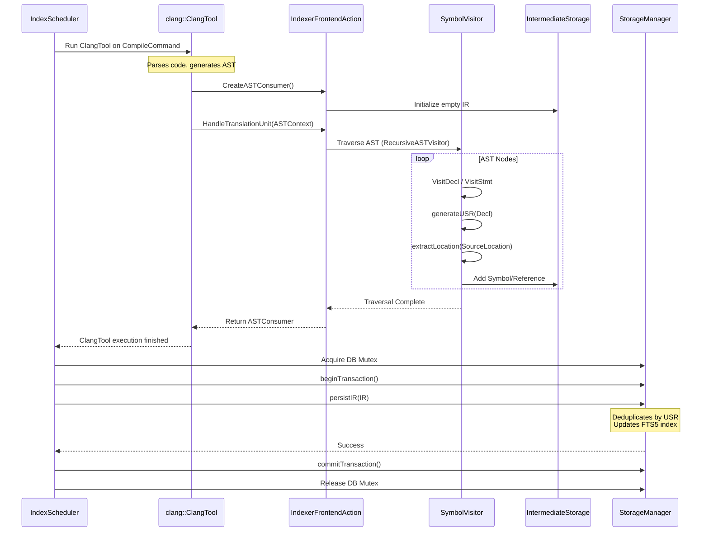
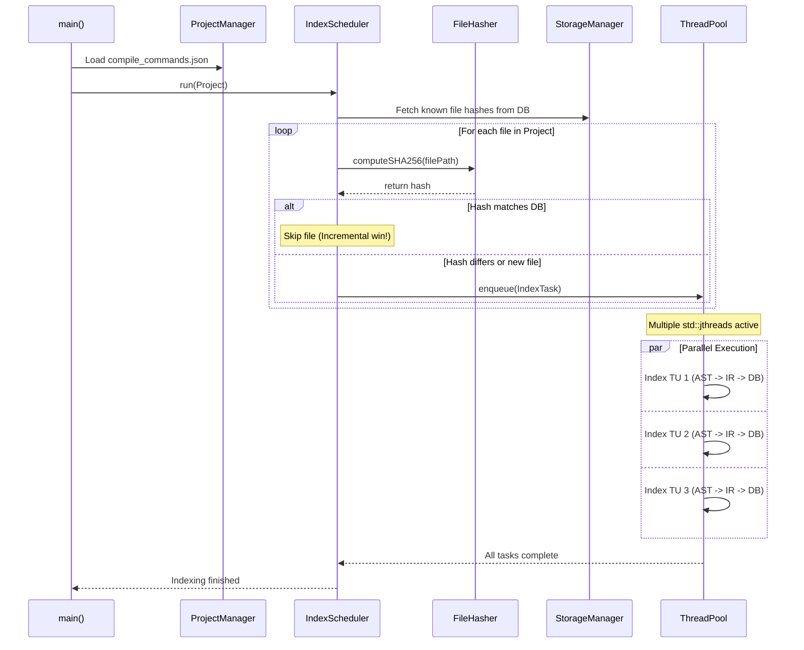

# Sourcetrail C++20 Indexer

A from-scratch, modern C++20 rewrite of the Sourcetrail indexing engine. This tool parses C/C++ source code using Clang's `libTooling`, extracts semantic information (symbols, references, inheritance, calls), and stores it in a high-performance SQLite database for fast querying and code navigation.

## Table of Contents
- [Key Features](#key-features)
- [Architecture Overview](#architecture-overview)
- [Class Diagram](#class-diagram)
- [Sequence Diagrams](#sequence-diagrams)
  - [1. End-to-End Indexing Pipeline](#1-end-to-end-indexing-pipeline)
  - [2. Incremental Indexing & Scheduling](#2-incremental-indexing--scheduling)
- [Building the Project](#building-the-project)
- [Usage](#usage)

---

## Key Features

- **Modern C++20**: Heavily utilizes Concepts, Ranges, `std::expected`, `std::jthread`, and `std::format`.
- **Clang `libTooling`**: Direct C++ AST traversal for unmatched accuracy, template support, and type resolution.
- **Multi-TU Concurrency**: Thread-pool scheduling to index multiple Translation Units in parallel.
- **Incremental Indexing**: SHA-256 file hashing and dependency graph tracking to only re-index what changed.
- **Robust Storage**: Optimized SQLite backend with FTS5 for fuzzy symbol searching.
- **Error Resilient**: Uses `std::expected` for recoverable errors, ensuring one bad TU doesn't crash the indexer.

---

## Architecture Overview

The indexer is decoupled into three main layers:
1. **Project & Scheduling Layer**: Manages `compile_commands.json`, tracks file staleness, and dispatches work to a thread pool.
2. **AST Extraction Layer**: Uses Clang `FrontendAction` and `RecursiveASTVisitor` to walk the AST, resolving USRs (Unified Symbol Resolution) and source locations.
3. **Storage Layer**: An RAII SQLite wrapper that batches inserts into an intermediate representation (IR) and commits them transactionally.

---

## Class Diagram

```mermaid
classDiagram
    direction LR
    
    namespace Project {
        class ProjectManager {
            -CompilationDatabase db_
            -std::vector~std::string~ file_paths_
            +load(path: fs::path) std::expected~void, ProjectError~
            +getCommands() const std::span~const std::string~
        }
    }

    namespace Scheduler {
        class IndexScheduler {
            -ThreadPool pool_
            -StorageManager& storage_
            -std::mutex db_mutex_
            +run(ProjectManager& project) void
            -indexTask(cmd: CompileCommand) void
        }
        
        class ThreadPool {
            -std::vector~std::jthread~ workers_
            -ConcurrentQueue~Task~ queue_
            +enqueue(task: Task) void
        }
    }

    namespace AST {
        class IndexerFrontendAction {
            +CreateASTConsumer(CompilerInstance&, file) std::unique_ptr~ASTConsumer~
        }
        
        class IndexerASTConsumer {
            -IntermediateStorage ir_
            +HandleTranslationUnit(ASTContext&) void
        }
        
        class SymbolVisitor {
            -ASTContext* ctx_
            -IntermediateStorage& ir_
            +VisitCXXRecordDecl(CXXRecordDecl*) bool
            +VisitFunctionDecl(FunctionDecl*) bool
            +VisitCallExpr(CallExpr*) bool
            -extractLocation(SourceLocation loc) Location
            -generateUSR(const NamedDecl*) std::string
        }
    }

    namespace Storage {
        class StorageManager {
            -sqlite3* db_
            +beginTransaction() void
            +commitTransaction() void
            +persistIR(IntermediateStorage& ir) void
        }
        
        class IntermediateStorage {
            +std::vector~Symbol~ symbols
            +std::vector~Reference~ references
            +std::vector~Location~ locations
            +clear() void
        }
    }

    namespace Core {
        class Symbol {
            +uint64_t id
            +SymbolKind kind
            +std::string name
            +std::string usr
        }
        class Reference {
            +uint64_t source_id
            +uint64_t target_id
            +ReferenceKind kind
            +Location location
        }
        class Location {
            +fs::path file
            +uint32_t line
            +uint32_t column
        }
    }

    ProjectManager --> IndexScheduler : provides commands
    IndexScheduler --> ThreadPool : uses
    IndexScheduler --> StorageManager : owns/coordinates
    IndexScheduler ..> IndexerFrontendAction : creates via ClangTool
    
    IndexerFrontendAction --> IndexerASTConsumer : creates
    IndexerASTConsumer --> SymbolVisitor : delegates traversal
    IndexerASTConsumer --> IntermediateStorage : populates
    
    SymbolVisitor ..> Symbol : creates
    SymbolVisitor ..> Reference : creates
    SymbolVisitor ..> Location : creates
    
    StorageManager ..> IntermediateStorage : consumes
    StorageManager ..> Symbol : persists
```



---

## Sequence Diagrams

### 1. End-to-End Indexing Pipeline

This diagram illustrates the lifecycle of indexing a single Translation Unit (TU) within the thread pool, from dispatch to database persistence.



### 2. Incremental Indexing & Scheduling

This diagram shows how the indexer decides *not* to index a file if it hasn't changed, and how it manages concurrency across multiple files.



---

## Building the Project

### Prerequisites
- **C++20 Compiler**: Clang 15+ or GCC 12+
- **CMake**: 3.25+
- **LLVM/Clang Development Libraries**: 15.0+
- **SQLite3**: Development headers

### Build Instructions

```bash
# Clone the repository
git clone https://github.com/yourusername/sourcetrail-cpp20-indexer.git
cd sourcetrail-cpp20-indexer

# Configure with CMake (LLVM_DIR might be required depending on your setup)
cmake -B build -DCMAKE_BUILD_TYPE=Release \
      -DLLVM_DIR=/path/to/llvm/lib/cmake/llvm \
      -DClang_DIR=/path/to/llvm/lib/cmake/clang

# Build
cmake --build build -j$(nproc)

# The executable will be at build/bin/indexer
```

---

## Usage

To index a project, you must first generate a `compile_commands.json` (usually done via CMake with `-DCMAKE_EXPORT_COMPILE_COMMANDS=ON`).

```bash
# Basic usage
./indexer --project /path/to/project --db /path/to/output.db

# Force full re-index (ignore incremental hashes)
./indexer --project /path/to/project --db /path/to/output.db --force

# Limit number of threads
./indexer --project /path/to/project --db /path/to/output.db --threads 4
```
