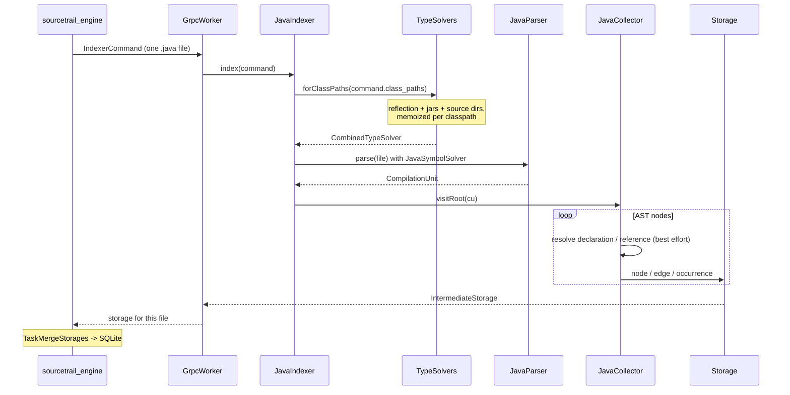

# Java Indexer

Sourcetrail's Java indexer plugin. It parses `.java` files with
[JavaParser](https://javaparser.org/), resolves symbols against the project's
classpath, walks the AST to extract declarations, references, inheritance and
call edges, and pushes the result back to the engine, which owns the SQLite
index.

Unlike the C/C++ plugin this is not a C++ library plus a worker — it is a single
JVM process, a shaded jar, launched by the engine as `java -jar`. It speaks the
same gRPC contract as `indexers/cxx/indexer`, so **there is no Java-specific code
path on the C++ side**.

Enabled by the CMake option `BUILD_JAVA_INDEXER`, which defaults `ON` when `mvn`
is on `PATH` and `OFF` otherwise. With it off, the plugin is never staged, the
manifest is never discovered, and the project wizard simply does not offer Java.

## Table of Contents
- [Layout](#layout)
- [How it is discovered](#how-it-is-discovered)
- [The worker process](#the-worker-process)
- [Indexing pipeline](#indexing-pipeline)
- [Name resolution](#name-resolution)
- [Two contracts that must not drift](#two-contracts-that-must-not-drift)
- [Building and testing](#building-and-testing)

---

## Layout

```
indexers/java/
  CMakeLists.txt        shells out to Maven, stages the jar + manifest
  indexer/              the Maven module
    pom.xml               deps, protobuf/gRPC codegen, shade plugin
    manifest.xml          plugin manifest (static, not a template)
    src/main/java/com/sourcetrail/indexer/
      Main.java             argv contract, logging setup
      GrpcWorker.java       the engine protocol loop
      Indexer.java          index(IndexerCommand) -> IntermediateStorage
      JavaIndexer.java      parse one file, own every failure
      TypeSolvers.java      CombinedTypeSolver from IndexerCommand.class_paths
      JavaCollector.java    the AST walk; emits nodes/edges/locations
      NameResolver.java     lexical FQN fallback (package + import table)
      Names.java            NameHierarchy::serialize, in Java
      Kinds.java            the C++ enum values, hand-mirrored
      Storage.java          buffers protos, allocates ids, dedups nodes
    src/test/java/com/sourcetrail/indexer/
      JavaIndexerTest.java  end-to-end: source file -> IntermediateStorage
      NamesTest.java        byte-for-byte serialization assertions
      GrpcWorkerTest.java   the protocol loop against an in-process fake engine
```

The protos are **not vendored**: `pom.xml` points `protoSourceRoot` at
`../../../src/lib/proto`, so `sourcetrail_common.proto` and
`indexer_worker.proto` are the single source of truth and the Java stubs are
regenerated on every `mvn package`.

## How it is discovered

Exactly like the built-in C/C++ plugin — through a manifest, with no special
case anywhere in the engine. `indexers/java/CMakeLists.txt` copies
`indexer/manifest.xml` and the shaded jar into `<build>/app/plugins/java/`, and
`IndexerPluginRegistry::discover()` (`src/lib/lib/app/`) scans
`<app>/plugins/*/manifest.xml` at engine startup.

```xml
<config>
  <id>java</id>
  <name>Java</name>
  <language>Java</language>
  <commandType>indexer_command_java</commandType>
  <source_group_types>
    <source_group_type>Java Source Group</source_group_type>
  </source_group_types>
  <launcher>java</launcher>
  <launcherArgs><arg>-jar</arg></launcherArgs>
  <indexerExecutable>sourcetrail_java_indexer.jar</indexerExecutable>
</config>
```

`<launcher>` and `<launcherArgs>` are what make a non-native worker possible:
`TaskBuildIndex::runIndexerProcess` prepends them and inserts the jar path, so
the spawn becomes `java -jar <jar> <processId> ...`. Two consequences worth
knowing:

- The registry checks that `<indexerExecutable>` (the jar) exists and drops the
  whole plugin if it does not — a manifest without its binary is worse than no
  manifest, because the project still looks reindexable.
- It does **not** check the launcher. A missing `java` on `PATH` surfaces only
  once indexing starts.

The engine reports the discovered source-group types over `GetCapabilities`;
`QtProjectWizardContentSelect` gates the Java option on
`supportsSourceGroupType(SOURCE_GROUP_JAVA_EMPTY)` and never inspects the plugin
directory itself.

Routing is per-run, not per-file: `IndexTaskBuilder` resolves a single
`IndexerCommandType` from the first enabled non-custom source group's language,
so a mixed C++/Java project currently spawns only one kind of worker.

## The worker process

```
java -jar sourcetrail_java_indexer.jar <processId> --engine-endpoint <host:port> <sharedDataPath> <userDataPath> [logFilePath]
```

Byte-for-byte the argv contract of `indexers/cxx/indexer/main.cpp`. The shared
and user data paths exist for parity — the C++ worker needs them to locate
`ApplicationSettings`; this one reads no settings file. `logFilePath` is only
passed when verbose indexer logging is enabled, and without it the worker logs
nothing at all: the engine captures the worker's output and greps it for
`INDEXER_TIMING`, so anything else on those streams is noise.

`GrpcWorker` mirrors `GrpcIndexer.cpp` (`src/features/indexing/logic/grpc/`):

| Step | RPC | Notes |
| --- | --- | --- |
| watcher | `WatchInterrupt` (stream) | async, sets a flag the loop polls |
| 1 | `PullCommand` | `command_found=false` + `queue_closed=false` means *not yet*, keep pulling — the engine parks the call for ~1s on your behalf |
| 2 | `ReportStatus` `START_FILE` | carries `file_path` |
| 3 | *(local)* | `JavaIndexer.index` |
| 4 | `PushIntermediateStorage` | |
| 5 | `ReportStatus` `FINISH_FILE` | **only if the push succeeded** |
| exit | `ReportStatus` `PROCESS_DONE` | always |

Two of those are load-bearing and easy to get wrong. Exiting on
`command_found=false` burns one of the three respawns `TaskBuildIndex` allows
before it abandons a worker. And sending `FINISH_FILE` after a failed push marks
the file complete-but-empty; withholding it leaves the file registered in flight,
so the engine routes it through `drainAndGetCrashedFiles()` and the user sees an
error instead of silence.

The channel also raises the inbound message limit: gRPC-Java defaults to 4 MB,
which a large file blows through as `RESOURCE_EXHAUSTED`, while the C++ side uses
`grpc_indexer::UnlimitedMessageSize`.

## Indexing pipeline



`Storage` allocates ids from 1 (`FILE_ID = 1` is the file node) and dedups nodes
on `(type, serializedName)` within the file, so a symbol referenced fifty times
is one node and a reference to something declared in the same file lands on the
declaration's id. The engine's `Storage::inject` then remaps ids across worker
processes at merge time.

Every reference edge gets a `StorageOccurrence` tying it to a source range —
that, not the edge itself, is what makes a reference clickable in the GUI.
Reference edges originate from the *enclosing symbol* (the method, else the
type), which is what makes the call graph navigable; only structural
`EDGE_MEMBER` edges hang off a type with no location of their own.

No failure escapes `JavaIndexer`: a parse error or an exception mid-walk keeps
whatever was collected, adds a `StorageError`, and sets `complete = false` on the
file, rather than taking the worker process down or — worse — returning an empty
storage that makes the file look successfully indexed.

## Name resolution

Two layers, in order:

1. **`JavaSymbolSolver`**, built by `TypeSolvers` from
   `IndexerCommand.class_paths` (which `SourceGroupSettingsWithJavaClassPath`
   fills in from the project settings): a `ReflectionTypeSolver` plus a
   `JarTypeSolver` per `.jar` and a `JavaParserTypeSolver` per directory. The
   solver is cached on the classpath list, because one worker indexes hundreds of
   files with an identical one and building a `JarTypeSolver` means reading a
   jar's whole entry table.

2. **`NameResolver`**, a purely lexical fallback: package declaration plus the
   import table, wildcard imports skipped.

Declarations and call sites both serialize their names from the *resolved*
declaration whenever the solver can supply one, so the two sides produce the
identical string and merge into a single node across files. Anything the solver
cannot resolve falls back to layer 2 and its location is marked
`LOCATION_UNSOLVED`, so the GUI shows it as unresolved rather than as a confident
wrong answer. A project with no configured classpath still produces a usable
graph, just a shallower one.

## Two contracts that must not drift

1. **`Names`** reproduces `NameHierarchy::serialize`
   (`src/lib/lib/data/name/NameHierarchy.cpp`) — a tab-delimited form the C++
   read path re-hydrates on every lookup, and the key the engine dedups nodes on
   at merge time. A formatting mismatch does not error; it silently splits one
   symbol into two. `NamesTest` pins it byte for byte.

2. **`Kinds`** hard-codes the integer values of five C++ enums:
   `src/features/graph/domain/{NodeKind,Edge,DefinitionKind}.h`,
   `src/lib/lib/data/parser/AccessKind.h`,
   `src/lib/lib/data/location/LocationType.h`. **Nothing checks these at build
   time.** If you touch any of those headers, update `Kinds.java` in the same
   change.

## Building and testing

Requires **JDK 21** and Maven (`maven.compiler.release=21`).

Through CMake, as part of a normal build:

```bash
cmake --preset=ci_gnu_release      # BUILD_JAVA_INDEXER auto-ON when mvn is found
cmake --build build --target Sourcetrail_java_indexer
ls build/app/plugins/java/         # sourcetrail_java_indexer.jar + manifest.xml
```

The CMake target tracks the Java sources, `pom.xml` and the protos as inputs, so
Maven only re-runs when one of them changes. Configuring with
`-DBUILD_JAVA_INDEXER=ON` and no `mvn` on `PATH` is a hard configure error.

For iterating on the Java code, skip CMake and drive Maven directly:

```bash
mvn -f indexer/pom.xml package                               # stubs, compile, test, shade
mvn -f indexer/pom.xml test                                  # tests only
mvn -f indexer/pom.xml test -Dtest=JavaIndexerTest#emits_file_and_class_node
```

The shade plugin's `ServicesResourceTransformer` is load-bearing: without it
gRPC's `META-INF/services` entries collide and channel construction fails with
"Could not find a NameResolverProvider".

End-to-end, the only check that exercises the real gRPC path: run
`build/app/Sourcetrail` from its own directory, create a project with an
"Empty Java Source Group" pointed at a small multi-package tree, set the
classpath to its source root, and index. The class/method tree should populate,
and clicking a method should show its callers and callees.
