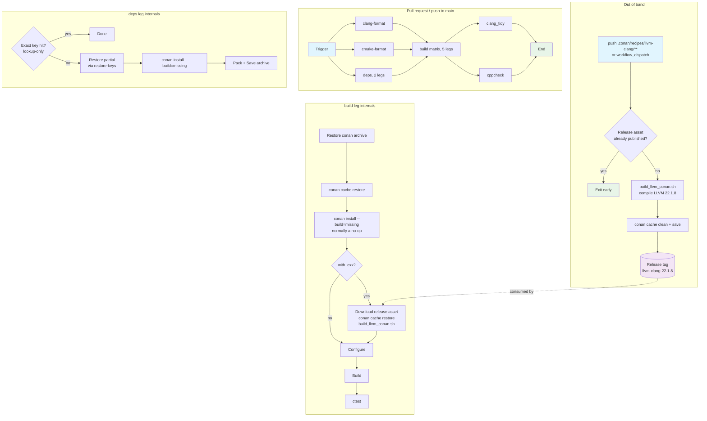

## Workflow Overview

**Purpose**: Validate every change to Sourcetrail by formatting, configuring, building and testing it across the supported compiler matrix, without ever recompiling third-party dependencies or LLVM/Clang on the pull-request path.

**Trigger Events**:

| Workflow | Events |
| --- | --- |
| `build.yml` | `push` to `main`, `pull_request` to `main` — both filtered on the same `paths` list |
| `llvm.yml` | `workflow_dispatch` (with `force_rebuild`), `push` to `main` on `.conan/recipes/llvm-clang/**`, `scripts/build_llvm_conan.sh`, `.github/workflows/llvm.yml` |
| `appimage.yml` | `workflow_dispatch`, `push` on tags matching `[0-9]+.[0-9]+.[0-9]+` |
| `clang_tidy.yml`, `cppcheck.yaml` | `workflow_call` only |

**Target Environments**: `ubuntu-24.04` and `windows-latest` GitHub-hosted runners. No deployment environments; the AppImage is the only distributable artifact.

## Execution Flow Diagram



## Jobs & Dependencies

| Job | Workflow | Purpose | Dependencies | Context |
| --- | --- | --- | --- | --- |
| `clang-format` | build.yml | Style-check modified `.cpp/.h/.hpp` | — | ubuntu-24.04 |
| `cmake-format` | build.yml | Style-check CMake files | — | ubuntu-24.04 |
| `deps` | build.yml | Build the Conan dependency archive once per OS and save it | — | matrix `os` (ubuntu-24.04, windows-latest) |
| `build` | build.yml | Configure, build, test the 5-leg matrix | `clang-format`, `cmake-format`, `deps` | matrix `os` |
| `clang_tidy` | build.yml → clang_tidy.yml | Lint changed sources against `compile_commands.json` | `build` (PR only) | ubuntu-24.04 |
| `cppcheck` | build.yml → cppcheck.yaml | Static analysis on the same artifact | `build` (PR only) | ubuntu-24.04 |
| `package` | llvm.yml | Produce and publish the LLVM/Clang Conan package | — | ubuntu-24.04 |
| `build` | appimage.yml | Produce the release AppImage | — | ubuntu-24.04 |

### Build matrix

| Leg | OS | tag | with_cxx | Indexer |
| --- | --- | --- | --- | --- |
| Windows Latest MSVC | windows-latest | msvc | `""` | no |
| Ubuntu Latest GCC | ubuntu-24.04 | gnu | `""` | no |
| Ubuntu Latest GCC with cxx_build | ubuntu-24.04 | gnu | `_build_cxx` | yes |
| Ubuntu Latest CLang | ubuntu-24.04 | clang | `""` | no |
| Ubuntu Latest CLang cxx_build | ubuntu-24.04 | clang | `_build_cxx` | yes |

`fail-fast: false`. There is deliberately **no** Windows `_build_cxx` leg — the LLVM recipe is validated on Linux/GCC only.

`tag` selects the CMake preset (`ci_<tag>_release<with_cxx>`) and nothing else. It is **not** part of the cache key: every Linux leg installs the same gcc/Release dependency set, so all four share one archive.

The `deps` job builds that archive; the matrix only restores it. `build` lists `deps` in `needs` but is **not** gated on its result — its `if:` requires only the two format jobs — so a `deps` failure degrades to a cold leg instead of skipping the run. Each build leg therefore keeps its own restore and `conan install --build=missing`, which is a no-op on the normal path.

## Requirements Matrix

### Functional Requirements

| ID | Requirement | Priority | Acceptance Criteria |
| --- | --- | --- | --- |
| REQ-001 | Third-party dependencies are restored from cache, never rebuilt, when `conanfile.txt`, the Conan profiles and the Conan client version are unchanged | High | `conan install` log contains zero `Building from source` lines on a warm run |
| REQ-002 | A change to one dependency rebuilds only that dependency | High | After editing `conanfile.txt`, the run reports a `restore-keys` partial hit and rebuilds a single package |
| REQ-003 | The dependency cache is written even when a later package fails to build | High | A `deps` run whose `conan install` fails part-way still shows `Save conan archive` as executed |
| REQ-004 | The default branch always holds a cache entry for the current dependency set | High | Every file feeding the cache key appears in both `paths:` filters |
| REQ-005 | LLVM/Clang is never compiled during a pull-request run | High | `_build_cxx` legs contain no LLVM compile output; LLVM acquisition is a download plus a cache restore |
| REQ-006 | `llvm.yml` checks for an existing published asset before building | High | A re-dispatch without `force_rebuild` exits after the check step |
| REQ-007 | `_build_cxx` presets resolve `Clang_DIR` with no extra flags | Medium | `external/lib/cmake/clang/` exists after `Install LLVM/Clang`; `cmake --preset=ci_gnu_release_build_cxx` succeeds |
| REQ-008 | The LLVM version is declared in one authoritative place per consumer | Medium | Bumping requires editing `conandata.yml`, `conanfile.py`, `LLVM_VERSION` in `llvm.yml`, and the `tag`/`fileName` pair in `build.yml` + `appimage.yml` |

### Security Requirements

| ID | Requirement | Implementation Constraint |
| --- | --- | --- |
| SEC-001 | Workflows use the default `GITHUB_TOKEN`; no long-lived secrets | Release upload uses `permissions: contents: write` scoped to the `package` job in `llvm.yml` only |
| SEC-002 | All other jobs stay read-only on repository contents | No `permissions:` escalation in `build.yml` or `appimage.yml` |
| SEC-003 | Third-party actions are version-pinned | `actions/*@v4`, `robinraju/release-downloader@v1.12`, `jurplel/install-qt-action@v3` |
| SEC-004 | Restored cache content is trusted only within its own scope | Cache keys are namespaced by `runner.os` and Conan client version; PR-branch caches are isolated by GitHub |

### Performance Requirements

| ID | Metric | Target | Measurement Method |
| --- | --- | --- | --- |
| PERF-001 | Cached Conan archive size | < 1 GB per key, all keys < 10 GB total | Repository *Actions → Caches* page |
| PERF-002 | Warm `conan install` wall clock | ≤ 2 min | Step duration in the run log |
| PERF-006 | Warm `deps` job wall clock (the tax it adds before the matrix starts) | ≤ 1 min | `deps` job duration when `Look up conan archive` reports `cache-hit: true` |
| PERF-007 | Cold dependency builds per run | 1 per OS, not 1 per matrix leg | Count `Building from source` across all jobs in a cold run |
| PERF-003 | LLVM acquisition on a `_build_cxx` leg | ≤ 3 min | `Download LLVM/Clang` + `Install LLVM/Clang` step durations |
| PERF-004 | From-source LLVM builds per pull request | 0 | Absence of LLVM compile lines in the build leg logs |
| PERF-005 | Conan cache hit rate on unchanged dependencies | 100% | `Restore conan archive` reports `cache-hit: true` |

## Input/Output Contracts

### Inputs

```yaml
# Environment Variables
LLVM_VERSION: string   # llvm.yml only; the recipe version, e.g. "22.1.8"
GH_TOKEN: secret       # llvm.yml only; the default GITHUB_TOKEN, for release create/upload

# Workflow dispatch inputs (llvm.yml)
force_rebuild: boolean # Rebuild and re-upload even if the asset exists

# Repository triggers (build.yml, identical on push and pull_request)
paths:
  - "**/*.h"
  - "**/*.hpp"
  - "**/*.cpp"
  - "**/CMakeLists.txt"
  - "**/*.cmake"
  - "CMakePresets.json"
  - "conanfile.txt"
  - ".conan/**"
  - "scripts/**"
  - ".github/workflows/*.yml"
branches: ["main"]
```

### Outputs

```yaml
# llvm.yml
release_asset: file    # llvm-clang-<version>-linux-x86_64.tgz on tag llvm-clang-<version>

# build.yml
build-artifact-<pr>: directory   # compile_commands.json + build/src, consumed by clang_tidy/cppcheck
build-logs-<tag><with_cxx>: file  # on failure only
ctest-logs-<tag><with_cxx>: file  # on failure only

# appimage.yml
AppImage: file
```

### Cache Contract

| Cache | Key | Restore keys | Payload |
| --- | --- | --- | --- |
| Conan dependencies | `conan5-<os>-<CONAN_VERSION>-<hash(conanfile.txt, .conan/gcc/profile)>` | `conan5-<os>-<CONAN_VERSION>-` | One `conan cache save --no-source` tgz at `${runner.temp}/conan-deps.tgz` |
| Qt | managed by `install-qt-action` | — | prefix `install-qt-action-{linux,windows}` |

**Invariant**: the cached path is a single archive file, never `~/.conan2`. See EDGE-001.

### Secrets & Variables

| Type | Name | Purpose | Scope |
| --- | --- | --- | --- |
| Secret | `GITHUB_TOKEN` | Release read (downloader) and write (llvm.yml upload), artifact access | Per job, default permissions |

## Execution Constraints

### Runtime Constraints

- **Timeout**: `llvm.yml` job `package` — 360 min. Others use the GitHub default (360 min).
- **Concurrency**: no `concurrency:` group is declared; runs stack per ref.
- **Resource Limits**: standard GitHub-hosted runners. Repository cache budget is 10 GB; the design keeps the dependency archive well below it and moves LLVM (~450 MB) to release assets entirely.

### Environmental Constraints

- **Runner Requirements**: `ubuntu-24.04` with apt `gcc g++ clang ninja-build python3-pip grep mold`; `windows-latest` with MSVC 2022 Enterprise (`vcvars64.bat`).
- **Network Access**: PyPI (Conan), Qt mirrors (aqtinstall), GitHub Releases, Conan Center.
- **Permissions**: read-only by default; `contents: write` only on `llvm.yml`'s `package` job.
- **Toolchain**: Qt 6.10.3 via aqtinstall 3.3.x; LLVM/Clang 22.1.8; Conan pinned to `env.CONAN_VERSION` in all three workflows — see EDGE-004.

## Error Handling Strategy

| Error Type | Response | Recovery Action |
| --- | --- | --- |
| Conan cache miss | Build dependencies from source; still pack and save the archive | None needed; the next run hits |
| Conan cache restore of a corrupt archive | `conan cache restore` fails the step | Delete the cache entry in the UI; the next run repacks |
| Build failure | Upload `build.log`, fail the job | `Save conan archive` still runs (`if: always()`), so the retry is warm |
| Test failure | Upload `report.xml`, publish the JUnit report, fail the job | Fix and push |
| LLVM release asset missing | `release-downloader` fails the `_build_cxx` legs | Dispatch `llvm.yml` to publish it |
| LLVM build failure in `llvm.yml` | Job fails; no asset published; existing asset untouched | Re-dispatch with `force_rebuild` after fixing the recipe |
| Release already exists | `gh release view || gh release create` tolerates it; `--clobber` overwrites the asset | None |

## Quality Gates

| Gate | Criteria | Bypass Conditions |
| --- | --- | --- |
| clang-format | Modified `.cpp/.h/.hpp` are clean under `--dry-run --Werror` | No matching files changed |
| cmake-format | `--config-files .cmake-format.yaml --check` passes | None |
| Build | All 5 matrix legs compile | None (`fail-fast: false` reports every leg) |
| Tests | `ctest` passes; Windows excludes a documented regex of known-failing tests | The Windows exclusion list |
| clang-tidy | `-warnings-as-errors='*'` on changed files | Non-PR events (job is PR-gated) |
| cppcheck | No findings after the XML filter | No files to analyse (`SKIP_NEXT_STEPS`) |

## Monitoring & Observability

### Key Metrics

- **Success Rate**: target ≥ 95% of `main` runs green.
- **Execution Time**: target ≤ 35 min for the slowest `build` leg on a warm cache.
- **Resource Usage**: repository cache total, checked on the *Actions → Caches* page; must stay under 10 GB so no entry is evicted to make room.

### Alerting

| Condition | Severity | Notification Target |
| --- | --- | --- |
| `main` build fails | High | GitHub default notifications to committers |
| `Restore conan archive` misses on an unchanged `conanfile.txt` | Medium | Manual review — indicates a key or eviction regression |
| Repository cache total approaches 10 GB | Medium | Manual review of *Actions → Caches* |
| `llvm.yml` fails | Low | Dispatcher; `_build_cxx` legs keep working off the previous asset |

## Integration Points

### External Systems

| System | Integration Type | Data Exchange | SLA Requirements |
| --- | --- | --- | --- |
| Conan Center | Package download | Recipes and prebuilt binaries | Best effort; cache absorbs outages |
| Qt mirrors (aqtinstall) | Binary download | Qt 6.10.3 archives | Best effort; `install-qt-action` cache absorbs outages |
| GitHub Releases | Asset up/download | LLVM Conan package tgz | Durable; not subject to cache eviction |
| GitHub Actions Cache | Restore/save | Conan dependency archive | 10 GB budget, 7-day unused eviction |

### Dependent Workflows

| Workflow | Relationship | Trigger Mechanism |
| --- | --- | --- |
| `clang_tidy.yml` | Consumes `build-artifact-<pr>` | `workflow_call` from `build.yml`, `needs: build` |
| `cppcheck.yaml` | Consumes `build-artifact-<pr>` | `workflow_call` from `build.yml`, `needs: build` |
| `llvm.yml` | Produces the asset `build.yml` and `appimage.yml` consume | Decoupled — a published release tag, not a job dependency |

## Compliance & Governance

### Audit Requirements

- **Execution Logs**: GitHub default retention. Failure artifacts (`build.log`, `report.xml`) retained 7 days.
- **Approval Gates**: none automated; branch protection governs merges to `main`.
- **Change Control**: workflow edits are themselves covered by the `paths:` filter, so any change to `.github/workflows/*.yml` runs the full matrix.

### Security Controls

- **Access Control**: least-privilege `GITHUB_TOKEN`; write scope confined to `llvm.yml`.
- **Secret Management**: no repository secrets beyond the default token; nothing to rotate.
- **Vulnerability Scanning**: not part of this workflow set.

## Edge Cases & Exceptions

| ID | Scenario | Expected Behavior | Validation Method |
| --- | --- | --- | --- |
| EDGE-001 | The full `~/.conan2` tree (~14 GB: build trees, extracted sources, download tarballs) exceeds the 10 GB repository budget | Never cache the tree. Cache one `conan cache save --no-source` archive of package binaries only, after `conan cache clean --source --build --download --temp` | Compare the archive size against the *Actions → Caches* budget |
| EDGE-002 | A dependency bump lands on a pull-request branch | `restore-keys` yields a partial hit; only the changed package is rebuilt; the new key is saved | Inspect `cache-matched-key` vs `cache-primary-key` in the run log |
| EDGE-003 | A pull request never sees another pull request's cache | Accepted — GitHub scopes PR caches to their own ref. `main` must therefore hold an entry for the current dependency set, which REQ-004's `paths:` list guarantees | Confirm `conanfile.txt` is present in both `paths:` lists |
| EDGE-004 | A new Conan client whose package_ids differ | `CONAN_VERSION` is pinned per workflow and is part of the cache key, so a bump rotates the key rather than restoring an archive that silently forces a full rebuild. Pinning is also what lets `deps` compute the key *before* installing anything, which is what makes its `lookup-only` warm path cheap | Bump `CONAN_VERSION`; the next run must report a miss, then a save |
| EDGE-005 | `conan install` in `deps` dies part-way through a cold build | `Pack conan archive` and `Save conan archive` run under `!cancelled()`, so whatever did build is banked and the retry is warmer. They are additionally gated on `steps.conan.outcome == 'success'` — without it, a job that dies before Conan is installed reports `conan: command not found` and masks the real error | Break one recipe and inspect the run |
| EDGE-006 | The `ci_clang_release_build_cxx` leg consumes an LLVM package built with `.conan/gcc/profile` | Works: `lib_cxx` uses `find_package(Clang)` against the install tree and Clang links libstdc++ on Linux, so the ABI matches | The clang `_build_cxx` leg builds and its tests pass |
| EDGE-007 | The LLVM release asset is deleted or the tag is missing | `_build_cxx` legs fail fast at the download step rather than compiling LLVM for hours and hitting the job timeout | Rename the tag in a scratch branch and observe the failure mode |
| EDGE-008 | `llvm.yml` is dispatched while the asset already exists | Every build step is skipped via `steps.check.outputs.exists` | Re-dispatch without `force_rebuild` |
| EDGE-009 | A `conan cache save` archive is restored into a cache that already holds those packages | `conan cache restore` is idempotent; existing revisions are overwritten with identical content | Run the restore twice locally |
| EDGE-010 | A cold key with no `deps` job would have all four Linux legs build an identical dependency set at once (~28 min each) and three then lose the save race | `deps` builds it once and the matrix restores. On the warm path `deps` is a `lookup-only` probe that adds only its own job startup | Cold run: one `Save conan archive`, and every build leg's `conan install` logs zero `Building from source` |
| EDGE-011 | A Conan profile naming a linker the machine does not have | `[buildenv] LD=` is not probed the way `set_alternate_linker.cmake` probes with `find_program`. An absent linker makes autotools `configure` report "shared libraries: yes" while producing none, and `libtool/2.4.7` then dies in `package()` on `cannot stat 'libltdl/.libs/libltdl.so.7.3.2'`. The profile therefore names no linker; the application still gets mold via `USE_ALTERNATE_LINKER`, which falls back silently | `conan install --requires=libtool/2.4.7 --build=missing` into an empty `CONAN_HOME` with `LD` set to a nonexistent binary reproduces it |
| EDGE-012 | Qt 6.11.x on Windows | aqtinstall 3.3.0 (newest) cannot resolve it — the 6.11 Windows repo is split into arch subdirectories (`qt6_6110/qt6_6110_msvc2022_64/`) that aqt looks for at `qt6_6110/qt6_6110/`. CI pins 6.10.3 on every host | `aqt list-qt windows desktop --arch 6.11.0` fails; `--arch 6.10.3` succeeds |

## Validation Criteria

### Workflow Validation

- **VLD-001**: Every workflow file parses as valid YAML (GitHub Actions does **not** support YAML anchors/aliases — the `paths:` list is duplicated verbatim between the two triggers by necessity).
- **VLD-002**: `build.yml`'s `push.paths` and `pull_request.paths` are identical.
- **VLD-003**: No workflow references `~/.conan2` or `C:\Users\runneradmin\.conan2\` as a cache `path:`.
- **VLD-004**: No workflow references an expired artifact `run-id` or a Clang version other than the one in `conandata.yml`.
- **VLD-005**: `scripts/build_llvm_conan.sh` is invoked, not reimplemented, wherever LLVM is installed.
- **VLD-006**: Every `_build_cxx` leg is preceded by both a `Download LLVM/Clang` and an `Install LLVM/Clang` step.

### Performance Benchmarks

- **PERF-B01**: Two consecutive runs on an unchanged `conanfile.txt` — the second reports `cache-hit: true` and logs zero `Building from source`.
- **PERF-B02**: `conan cache save "*:*" --no-source` after `conan cache clean` produces an archive small enough that all matrix keys together stay under 10 GB.
- **PERF-B03**: A `_build_cxx` leg spends under 3 minutes acquiring LLVM, versus hours compiling it.

## Change Management

### Update Process

1. **Specification Update**: modify this document first.
2. **Review & Approval**: pull request review under branch protection on `main`.
3. **Implementation**: apply changes to the workflow files.
4. **Testing**: open a throwaway pull request; walk the PERF-B benchmarks and the EDGE scenarios that the change touches.
5. **Deployment**: merge to `main`, which repopulates the default-branch cache for every subsequent pull request.

### Bumping the LLVM version

1. Edit `.conan/recipes/llvm-clang/conandata.yml` (URL + sha256) and the `version` in `conanfile.py`.
2. Edit `LLVM_VERSION` in `.github/workflows/llvm.yml`.
3. Edit the `tag:` and `fileName:` inputs in `build.yml` and `appimage.yml`, and the `conan cache restore` path beside them.
4. Update `README.md` and `CLAUDE.md`.
5. Push to `main` — the `paths:` filter on `llvm.yml` fires the build automatically.

### Version History

| Version | Date | Changes | Author |
| --- | --- | --- | --- |
| 1.3 | 2026-08-25 | Removed `LD=mold` from `.conan/gcc/profile` (it broke `libtool` on runners without mold) and installed mold on the build runners so `USE_ALTERNATE_LINKER` stops falling back. | DevOps Team |
| 1.2 | 2026-08-25 | Added the `deps` job so dependencies are built once per OS instead of once per matrix leg; pinned the Conan client via `env.CONAN_VERSION`; cache key prefix `conan4-` → `conan5-`. | DevOps Team |
| 1.1 | 2026-08-25 | Post-run-#599 fixes: one Linux dependency set (clang presets consume `.conan/gcc`), `tag` dropped from the cache key, `libtool` serialised, Qt pinned to 6.10.3, Pack/Save guards tightened. | DevOps Team |
| 1.0 | 2026-08-25 | Initial specification. Replaces the `~/.conan2` cache with a `conan cache save` archive; moves LLVM/Clang 22 to a release asset built by `llvm.yml`; drops the Windows `_build_cxx` leg and the two manual `clang_build_*` workflows; bumps Qt to 6.11.0. | DevOps Team |

## Related Specifications

- `CLAUDE.md` — build system, presets and the single-Conan-install rule for Linux
- `README.md` — developer build instructions, including restoring the LLVM release asset locally
- `.conan/recipes/llvm-clang/conanfile.py` — the authoritative LLVM build flags
- `scripts/build_llvm_conan.sh` — the cache-first LLVM install used identically by CI and developers
