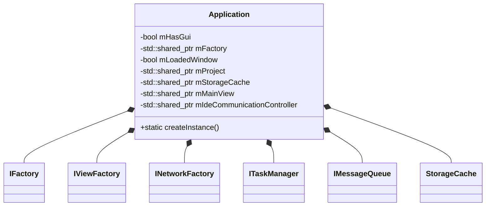
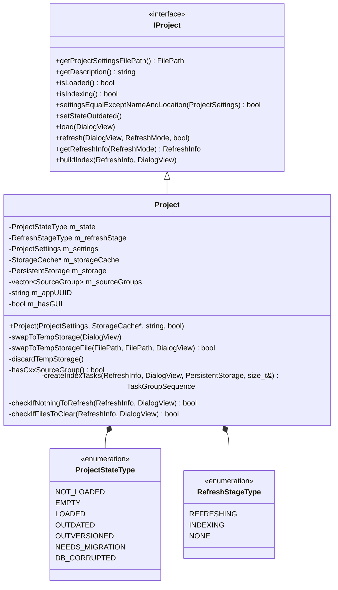
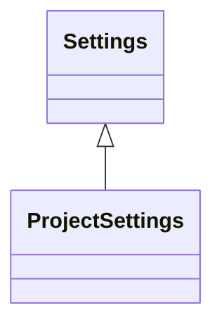

# Sourcetrail_lib

## Description

It contains the bussines logic.

## Components

- app
- component
- data
- factory
- project
- setttings
- utility

## UMLs

### Application

### Project

### Settings

