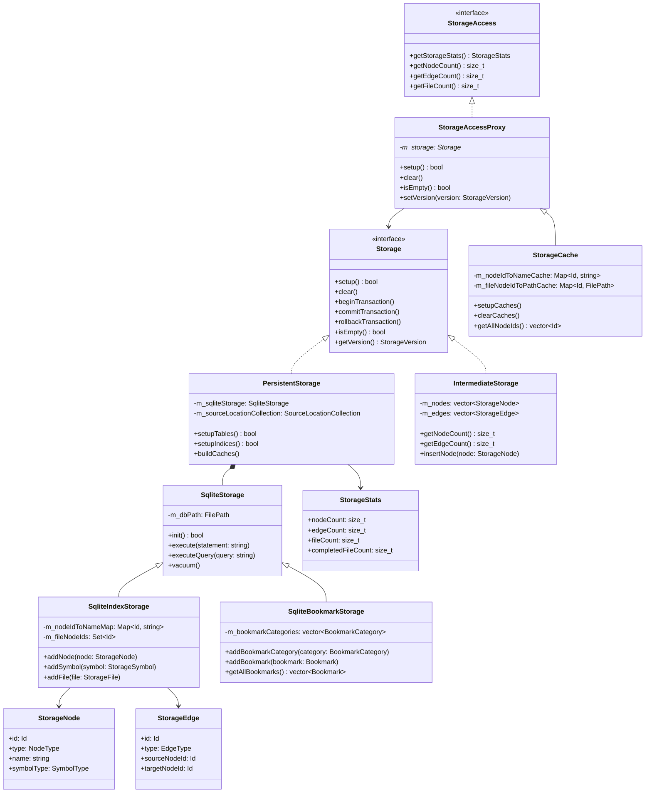
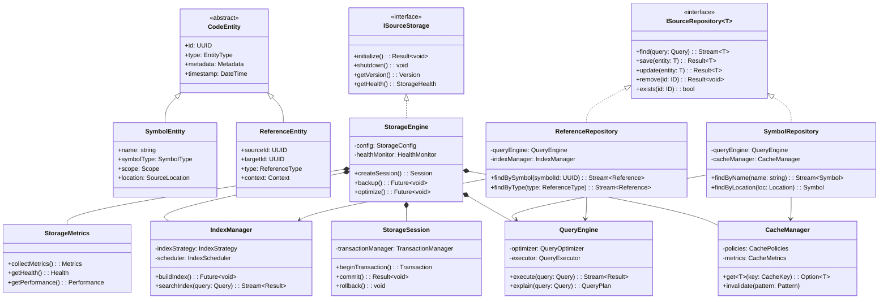
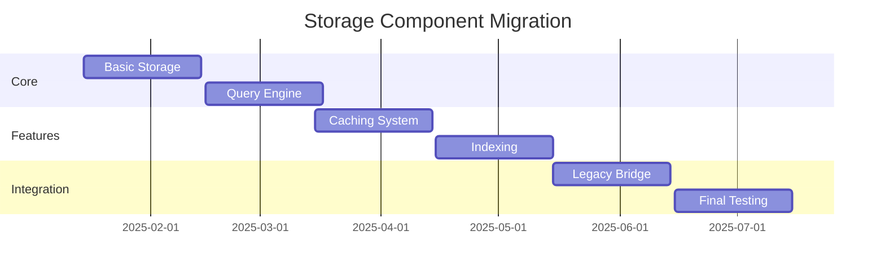

# Datalayer

## Current implemenation

## Future implemenation

## Sourcetrail Storage Migration Roadmap

### Phase 1: Foundation Setup (4-6 weeks)

#### 1.1 Core Infrastructure

- [ ] Set up new project structure for the optimized storage system
- [ ] Implement base interfaces (ISourceStorage, ISourceRepository)
- [ ] Create core domain entities (CodeEntity, SymbolEntity, ReferenceEntity)
- [ ] Implement Result and Stream utility classes
- [ ] Set up comprehensive testing framework

#### 1.2 Basic Storage Operations

- [ ] Implement basic StorageEngine functionality
- [ ] Create Session management system
- [ ] Implement fundamental transaction handling
- [ ] Set up basic error handling infrastructure

#### 1.3 Initial Testing & Validation

- [ ] Create test suite for core components
- [ ] Validate basic storage operations
- [ ] Performance benchmarking of basic operations
- [ ] Document initial architecture

### Phase 2: Advanced Features Implementation (6-8 weeks)

#### 2.1 Query Engine

- [ ] Implement QueryEngine core
- [ ] Create query optimization system
- [ ] Develop query execution engine
- [ ] Add query caching mechanism

#### 2.2 Caching System

- [ ] Implement CacheManager
- [ ] Add cache policies (LRU, LFU)
- [ ] Implement cache metrics
- [ ] Create cache invalidation strategies

#### 2.3 Index Management

- [ ] Implement IndexManager
- [ ] Create indexing strategies
- [ ] Add index optimization
- [ ] Implement search functionality

### Phase 3: Migration Tools & Bridge (4-6 weeks)

#### 3.1 Data Migration Tools

- [ ] Create data migration scripts
- [ ] Implement format converters
- [ ] Add validation tools
- [ ] Create rollback mechanisms

#### 3.2 Legacy Bridge

- [ ] Implement adapter layer for legacy code
- [ ] Create compatibility layer
- [ ] Add legacy API support
- [ ] Implement feature flags system

### Phase 4: Gradual Migration (8-12 weeks)

#### 4.1 Component Migration

#### 4.2 Migration Steps

1. Symbol Storage
   - Migrate basic symbol storage
   - Add new symbol features
   - Validate symbol operations
   - Performance testing

2. Reference Storage
   - Migrate reference handling
   - Implement new reference features
   - Cross-reference validation
   - Integration testing

3. Index Storage
   - Migrate index structures
   - Implement new indexing
   - Validate search operations
   - Performance optimization

### Phase 5: Testing & Optimization (4-6 weeks)

#### 5.1 Comprehensive Testing

- [ ] Unit tests for all components
- [ ] Integration tests
- [ ] Performance tests
- [ ] Migration tests
- [ ] Rollback tests

#### 5.2 Performance Optimization

- [ ] Query optimization
- [ ] Cache tuning
- [ ] Index optimization
- [ ] Memory usage optimization

### Phase 6: Deployment & Monitoring (4-6 weeks)

#### 6.1 Deployment Strategy

- [ ] Create deployment plans
- [ ] Set up monitoring
- [ ] Implement health checks
- [ ] Create rollback procedures

#### 6.2 Documentation & Training

- [ ] Technical documentation
- [ ] API documentation
- [ ] Migration guides
- [ ] Best practices

### Risk Mitigation Strategies

1. **Data Integrity**
   - Regular validation checks
   - Automated testing
   - Rollback capabilities
   - Data backup procedures

2. **Performance**
   - Regular benchmarking
   - Performance monitoring
   - Optimization cycles
   - Load testing

3. **Compatibility**
   - Legacy support
   - API versioning
   - Feature flags
   - Gradual rollout

### Success Metrics

- Zero data loss during migration
- Performance improvement > 30%
- Query response time reduction > 40%
- Memory usage reduction > 25%
- Successful migration of all existing features

### Timeline Summary

- Total Duration: 30-44 weeks
- Critical Path: Core Implementation → Migration Tools → Gradual Migration
- Buffer: 4-6 weeks for unexpected issues
