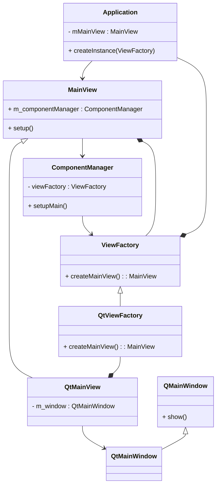
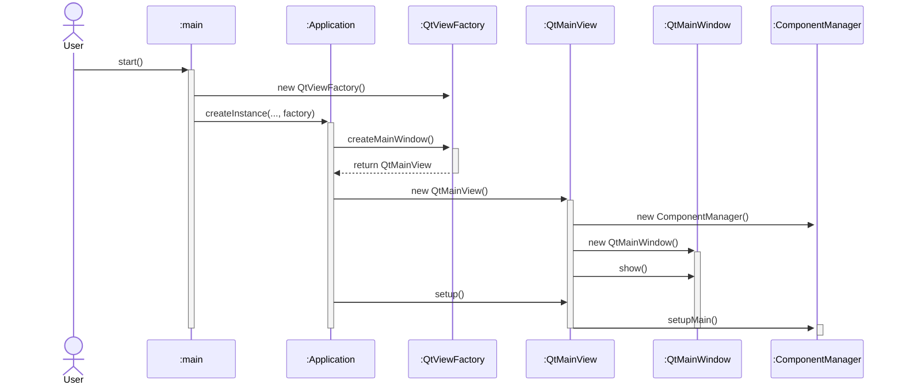

# QtMainWindow

## UML

### Class digram

```mermaid
classDiagram
    class Application{
        + createInstance(ViewFactory)
        - mMainView : MainView
    }
    class ViewFactory{
        + createMainView() : MainView
    }
    class QtViewFactory{
        + createMainView() : MainView
    }
    class MainView{
        + m_componentManager : ComponentManager
        + setup()
    }
    class QtMainView{
        - m_window : QtMainWindow
    }
    class QMainWindow{
        + show()
    }
    class QtMainWindow{
    }
    class ComponentManager{
        + setupMain()
        - viewFactory : ViewFactory
    }
    ViewFactory <|-- QtViewFactory
    MainView    <|-- QtMainView
    QMainWindow  <|-- QtMainWindow

    Application --> MainView

    QtMainView --> QtMainWindow

    Application   --* ViewFactory
    ViewFactory   --* MainView
    QtViewFactory --* QtMainView

    ComponentManager --> ViewFactory
    MainView --> ComponentManager

```

### Sequence digram

```mermaid
sequenceDiagram
    actor User
    participant Main as :main
    participant App as :Application
    participant Factory as :QtViewFactory
    participant View as :QtMainView
    participant Window as :QtMainWindow
    participant Manager as :ComponentManager

    User->>+Main: start()

    Main->>+Factory: new QtViewFactory()

    Main->>+App: createInstance(..., factory)

    App->>+Factory: createMainWindow()
    Factory-->>-App: return QtMainView

    App->>+View: new QtMainView()

    View->>+Manager: new ComponentManager()

    View->>+Window: new QtMainWindow()

    View->>Window: show()

    App->>View: setup()

    View->>+Manager: setupMain()
    deactivate Manager

    deactivate Window
    deactivate View
    deactivate App
    deactivate Main
```
